# BASALT PROTOCOL /// IMMUTABLE PROVENANCE ENGINE

   

**Basalt** is an enterprise-grade provenance layer that anchors digital media to the Solana blockchain. By combining **C2PA cryptographic signing** with **IPFS decentralized storage** and **Solana timestamping**, Basalt creates an indisputable chain of custody for digital assets.

---

## /// SYSTEM ARCHITECTURE

The Basalt pipeline ensures that every asset processed is cryptographically bound to its creator and timestamped on a public ledger.

```mermaid
sequenceDiagram
    participant Client as 📸 Client / Device
    participant API as ⚡ Basalt API
    participant C2PA as 🔐 C2PA Engine
    participant IPFS as 📦 IPFS Vault
    participant SOL as 🟣 Solana Timechain

    Client->>API: POST /notarize (Raw Asset)
    Note over API: 1. Ingest & Validate
    
    API->>C2PA: Inject Manifest & Sign (ES256)
    C2PA-->>API: Signed Asset (C2PA Valid)
    
    API->>IPFS: Pin Signed Asset
    IPFS-->>API: Return CID (Qm...)
    
    Note over API: 2. Calculate SHA-256 Hash
    
    API->>SOL: Anchor Hash + CID (Transaction)
    SOL-->>API: Transaction Signature
    
    API-->>Client: Digital Certificate (JSON)
```



---

## /// GETTING STARTED

### Prerequisites
*   Python 3.9+
*   OpenSSL
*   Solana Wallet (for Mainnet/Devnet)
*   Pinata API Key (for IPFS)

### 1. Installation

Clone the repository and install the dependencies:

```bash
git clone https://github.com/your-org/basalt-protocol.git
cd basalt-protocol
pip install -r requirements.txt
```

### 2. Security Setup (PKI)

Basalt requires a valid X.509 Certificate Authority chain to sign assets. For development, we provide a script to generate a compliant self-signed testing chain (Root CA -> Intermediate -> Leaf).

```bash
# Generate EC Param keys and Certificates
python setup_certs.py
```
*Output: `my_cert.pem` and `my_private_key.pem` will be generated. **DO NOT COMMIT THESE TO GIT.** check `.gitignore`.*

### 3. Environment Configuration

Create a `.env` file in the root directory:

```ini
# IPFS Provider (Pinata)
PINATA_JWT=your_pinata_jwt_here

# Solana Blockchain (Devnet/Mainnet)
SOLANA_PRIVATE_KEY=your_solana_private_key_base58
```

### 4. Ignite the Engine

Start the high-performance FastAPI server:

```bash
uvicorn main:app --reload
```

Access the **Basalt Console** at: `http://localhost:8000`

---

## /// API REFERENCE

### `POST /notarize`

Anchors a file to the blockchain.

**Request:** `multipart/form-data`
*   `file`: The image/asset to be secured.

**Response:** `200 OK`
```json
{
  "status": "SECURED",
  "evidence": {
    "ipfs_cid": "QmXyZ...",
    "ipfs_url": "https://gateway.pinata.cloud/ipfs/QmXyZ...",
    "sha256_hash": "a1b2c3d4...",
    "solana_tx": "https://explorer.solana.com/tx/5Kj...",
    "c2pa_verification": "ACTIVE"
  }
}
```

---

## /// ENTERPRISE USE CASES

### 🛡️ Insurance & Forensics
Eliminate fraud by verifying that accident photos and damage reports have not been manipulated since the moment of capture.

### 📰 Journalism & Media
Restore public trust by cryptographically proving the origin, location, and time of conflict zone footage and news photography.

### ⚖️ Legal & Compliance
Create admissible digital evidence with a mathematically provable chain of custody for contracts, IP, and sensitive documentation.

---

## /// DISCLAIMER

*This software is currently in **BETA**. While the cryptographic primitives are standard, do not use for high-value asset protection on Mainnet without a full security audit.*

**Basalt Protocol Inc. © 2026**
